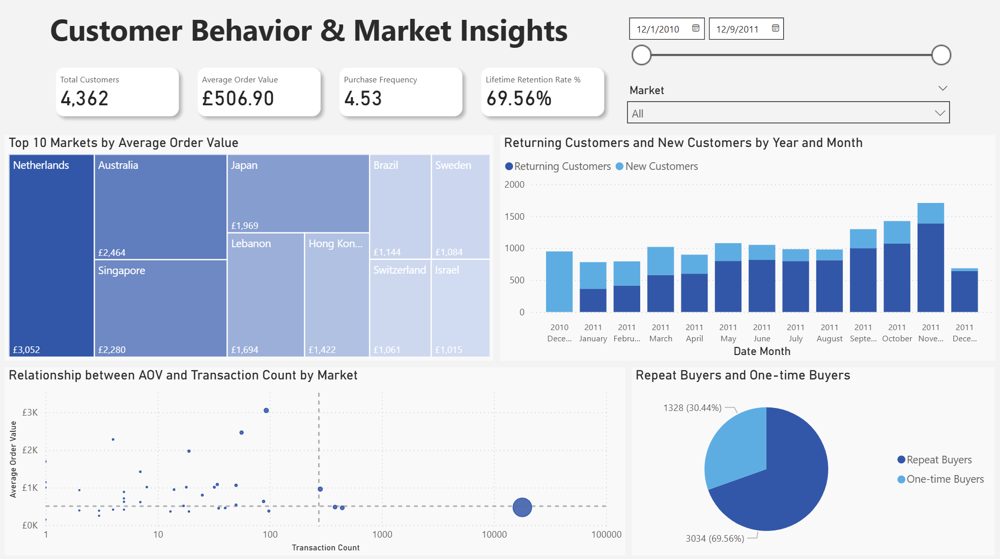

# Executive Sales Dashboard 

> [🇵🇱 Polska wersja językowa poniżej / Polish version below](#polska-wersja-językowa-pl)

---

## 1. Project Goal
The goal of this project is to develop an interactive analytics system that transforms raw sales data into actionable business insights. The system enables data-driven strategic decision-making regarding revenue, market performance, customer behavior, and product profitability.

## 2. Data Source & Structure
Data is sourced from the **Online Retail Dataset** provided by the UCI Machine Learning Repository. The dataset covers online store transactions across various countries between 2010 and 2011.

**Key Columns:**
*   `InvoiceNo` – Invoice number
*   `StockCode` – Product code
*   `Description` – Product name/description
*   `Quantity` – Number of units sold (negative values indicate returns)
*   `InvoiceDate` – Transaction date and time
*   `UnitPrice` – Unit price
*   `CustomerID` – Customer ID
*   `Country` – Customer's country

## 3. Tools & Techniques
The project utilizes **Microsoft Power BI** with a strong focus on ETL (Extract, Transform, Load) processes to ensure analysis reliability.

### A. Data Profiling & Correction
*   Analyzed data quality and identified null values to ensure consistency.
*   Corrected data types (e.g., currency, integers).
*   Standardized product names (*Capitalize Each Word*) and market names.

### B. Data Cleansing
*   Removed technical records (accounting adjustments, bank charges, tests).
*   Handled missing data: Unregistered customers marked as "Guest".
*   Applied dynamic row filtering in Power Query.

### C. Outlier Handling
*   Detected and removed unrealistic transactions (e.g., purchases > 80k units) to prevent skewing the Average Order Value (AOV).
*   Maintained `StockCode` as the primary product identifier.

### D. Data Modeling & DAX
*   Created calculated columns: `Revenue = Quantity * UnitPrice`.
*   Developed advanced DAX measures (including Cohort Analysis, Pareto Principle).

**[View full DAX documentation](DAX_Documentation.md)**

## 4. Business Analysis – Insights & Recommendations

### I. Financial Performance & Seasonality

**a. Business Questions:**
*   How is revenue trending over time, and is there visible seasonality?
*   Is the sales drop in December 2011 a real trend or due to incomplete data?

**b. Visualization:**
*   *Sales Overview* -> **Area Chart** (Gross & Net Revenue by Month)

**c. Key Insights:**
*   The company shows a strong upward trend in Q4, with a distinct sales peak in **November** (pre-holiday season).
*   The drastic drop visible in December 2011 is artificial, resulting from the dataset ending on December 9th (incomplete month).

**d. Recommendations:**
*   **Logistics Planning:** Key activities to **ensure full inventory levels** must be completed by October to handle the November sales peak.
*   **Reporting:** Management reports must clearly flag incomplete periods to avoid erroneous business decisions based on false drops.

---

### II. Product Efficiency & Pareto Principle

**a. Business Questions:**
*   Is there revenue concentration (Pareto Principle)?
*   Which bestsellers generate hidden costs through high return rates?
*   Which products belong to the "Long Tail" and generate storage costs?

**b. Visualization:**
*   *Product Performance* -> **Bar Chart** (Top 50 Products)
*   *Product Performance* -> **Scatter Plot** (Revenue vs. Volume Analysis)

**c. Key Insights:**
*   **Pareto Principle:** Analysis confirms the classic distribution – **20% of products (763 items) generate 77% of total revenue**. The remaining ~3000 products form the "Long Tail".
*   **Quality Challenge:** Although "White Hanging Heart" is a volume leader (**35,313 units** vs. the revenue leader's **13,022 units**), its profitability suffers due to quality issues. A **Return Rate of 6.23%** (vs. market avg 2.40%) means thousands of units return to the warehouse, generating losses.
*   **Value Leader:** The product *"Regency Cakestand 3 Tier"* is the revenue leader (£164k) despite lower volume, indicating a high unit margin.

**d. Recommendations:**
*   **Quality Audit:** Verify the specific batch and packaging of the *"White Hanging Heart"* product.
*   **Inventory Optimization:** Implement a continuous availability policy for the top 20% of products and consider **discontinuing** "Long Tail" items.

---

### III. Customer Profile & Loyalty

**a. Business Questions:**
*   Is growth driven by acquiring new customers or retaining existing ones?
*   What is the customer profile (B2B vs. B2C) considering purchase frequency and basket value?

**b. Visualization:**
*   *Customer Behavior* -> **Stacked Column Chart** (Returning vs New Customers)
*   *Customer Behavior* -> **KPI Cards** (Purchase Frequency, AOV)
*   *Customer Behavior* -> **Pie Chart** (Repeat Buyers)

**c. Key Insights:**
*   **High Loyalty:** The customer base is highly stable. The `Lifetime Retention Rate` is nearly **70%**, and the timeline shows that 2011 revenue growth was driven mainly by returning customers.
*   **B2B Characteristics:** The average purchase frequency is **4.53** transactions per customer, and the Average Order Value (AOV) is **£506**. This suggests a dominance of wholesale/business clients rather than retail consumers.

**d. Recommendations:**
*   **Strategy Shift:** Shift marketing budget from **acquisition** to **retention** and relationship management.
*   **Loyalty Program:** Implement discount tiers based on annual purchase volume to reward loyal B2B clients and encourage order consolidation.

---

### IV. Market Strategy & Geography

**a. Business Questions:**
*   Is the company dependent on a single market (Concentration Risk)?
*   Which foreign markets have the highest basket value?

**b. Visualization:**
*   *Sales Overview* -> **Bar Chart** (Top 5 Markets)
*   *Customer Behavior* -> **Scatter Plot** (AOV vs Transaction Count)
*   *Customer Behavior* -> **Tree Map** (Top 10 Markets by AOV)

**c. Key Insights:**
*   **Local Market Dominance:** The UK generates **85%** of total revenue. Such strong dependency on a single country poses a significant stability risk. Any local market issues would critically impact overall performance.
*   **Premium Markets:** Markets like Australia, Japan, and the Netherlands show a significantly higher Average Order Value (**AOV > £2000**) compared to the UK (~£400).

**d. Recommendations:**
*   **Export Strategy:** Treat export markets as a "Premium Wholesale" segment. High shipping costs are not a barrier there, as they are amortized by high order values.
*   **Diversification:** Expand into EU markets (e.g., Netherlands - #2 in Europe) to reduce dependency on the UK.

## 5. Contact
[LinkedIn Profile](https://www.linkedin.com/in/patryk-konarzewski-data)

---
---

# 🇵🇱 Polska wersja językowa (PL)

## 1. Cel projektu
Projekt ma na celu opracowanie interaktywnego systemu analitycznego, który przekształca surowe dane sprzedażowe w czytelne informacje biznesowe. System umożliwia podejmowanie trafniejszych, opartych na danych decyzji strategicznych w obszarze przychodów, rynków, klientów oraz rentowności produktów.

## 2. Źródło i struktura danych
Dane pochodzą z **Online Retail Dataset**, udostępnionego przez UCI Machine Learning Repository. Zestaw obejmuje transakcje sprzedaży sklepu internetowego w różnych krajach w okresie 2010–2011.

**Kluczowe kolumny:**
*   `InvoiceNo` – numer faktury
*   `StockCode` – kod produktu
*   `Description` – nazwa/opis produktu
*   `Quantity` – liczba sprzedanych sztuk (ujemne wartości oznaczają zwroty)
*   `InvoiceDate` – data i godzina transakcji
*   `UnitPrice` – cena jednostkowa
*   `CustomerID` – identyfikator klienta
*   `Country` – kraj klienta

## 3. Wykorzystane narzędzia i techniki
W projekcie zastosowano **Microsoft Power BI** z naciskiem na przygotowanie danych (ETL), aby zapewnić rzetelne analizy.

### A. Profilowanie i korekta danych
*   Analiza jakości danych i identyfikacja braków (null-e) w celu zapewnienia spójności.
*   Korekta typów danych (np. waluta, liczby całkowite).
*   Ujednolicenie nazw produktów (*Capitalize Each Word*) i rynków.

### B. Czyszczenie i filtrowanie (Data Cleansing)
*   Usunięcie rekordów technicznych (korekty księgowe, opłaty bankowe, testy).
*   Obsługa braków danych: niezalogowani klienci oznaczeni jako „Guest”.
*   Dynamiczne filtrowanie wierszy w Power Query.

### C. Obsługa Outlierów (Wartości Skrajnych)
*   Wykrycie i usunięcie nierealnych transakcji (np. zakupy powyżej 80 tys. sztuk), co zapobiegło zafałszowaniu średniej wartości koszyka (AOV).
*   Zachowanie `StockCode` jako głównego identyfikatora produktów.

### D. Modelowanie Danych i DAX
*   Stworzenie kolumn obliczeniowych: `Revenue = Quantity * UnitPrice`.
*   Przygotowanie zaawansowanych miar DAX (m.in. analiza kohortowa, Pareto).

**[Zobacz pełną dokumentację miar DAX](DAX_Documentation.md)**

## 4. Analiza Biznesowa – Pytania, Wnioski i Rekomendacje

### I. Kondycja Finansowa i Sezonowość

**a. Pytania Biznesowe:**
*   Jak kształtują się przychody w czasie i czy widoczna jest sezonowość sprzedaży?
*   Czy spadek sprzedaży w grudniu 2011 jest realnym trendem, czy wynika z niepełnych danych?

**b. Wizualizacja:**
*   *Sales Overview* -> **Area Chart** (Gross & Net Revenue by Month)

**c. Wnioski (Insights):**
*   Firma wykazuje silny trend wzrostowy w IV kwartale (Q4), z wyraźnym pikiem sprzedaży w **listopadzie** (przygotowania do świąt).
*   Widoczny na wykresie drastyczny spadek w grudniu 2011 jest pozorny i wynika z zakończenia zbioru danych w dniu 9 grudnia (niepełny miesiąc).

**d. Rekomendacja:**
*   **Planowanie Logistyki:** Kluczowe działania mające na celu **zapewnienie pełnych stanów magazynowych** muszą zakończyć się w październiku, aby obsłużyć listopadowy szczyt sprzedażowy.
*   **Raportowanie:** W raportach zarządczych należy wyraźnie oznaczać niepełne okresy, aby uniknąć błędnych decyzji biznesowych opartych na fałszywych spadkach.

---

### II. Efektywność Produktowa i Zasada Pareto

**a. Pytania Biznesowe:**
*   Czy występuje koncentracja przychodów (Zasada Pareto)?
*   Które bestsellery generują ukryte koszty poprzez wysoki wskaźnik zwrotów?
*   Które produkty należą do "Długiego Ogona" i generują koszty magazynowania?

**b. Wizualizacja:**
*   *Product Performance* -> **Bar Chart** (Top 50 Products)
*   *Product Performance* -> **Scatter Plot** (Revenue vs. Volume Analysis)

**c. Wnioski (Insights):**
*   **Zasada Pareto:** Analiza potwierdza klasyczny rozkład – **20% produktów (763 produkty) generuje aż 77% całkowitego przychodu**. Pozostałe ~3000 produktów to tzw. "Długi Ogon".
*   **Wyzwanie Jakościowe:** Mimo że "White Hanging Heart" sprzedał się w liczbie **35 313** egzemplarzy (znacznie więcej niż lider rankingu, który ma **13 022 szt.**), jego rentowność cierpi przez jakość. Wskaźnik zwrotów na poziomie 6.23% (przy średniej rynkowej 2.40%) oznacza, że tysiące sztuk wracają do magazynu, generując straty.
*   **Lider Wartości:** Produkt *"Regency Cakestand 3 Tier"* jest liderem przychodowym (£164k), mimo mniejszego wolumenu niż inne bestsellery, co oznacza wysoką marżę jednostkową.

**d. Rekomendacja:**
*   **Audyt Jakości:** Weryfikacja partii produktu *"White Hanging Heart"* oraz sposobu jego pakowania.
*   **Optymalizacja Magazynu:** Wdrożenie polityki ciągłej dostępności dla top 20% produktów oraz rozważenie **wycofania ze sprzedaży** produktów z końcówki "Długiego Ogona".

---

### III. Profil i Lojalność Klienta

**a. Pytania Biznesowe:**
*   Czy wzrost firmy opiera się na pozyskiwaniu nowych klientów, czy na utrzymaniu obecnych?
*   Jaki jest profil klienta (B2B vs B2C) biorąc pod uwagę częstotliwość zakupów i wartość koszyka?

**b. Wizualizacja:**
*   *Customer Behavior* -> **Stacked Column Chart** (Returning vs New Customers)
*   *Customer Behavior* -> **KPI Cards** (Purchase Frequency, AOV)
*   *Customer Behavior* -> **Pie Chart** (Repeat Buyers)

**c. Wnioski (Insights):**
*   **Wysoka Lojalność:** Baza klientów jest bardzo stabilna. Wskaźnik `Lifetime Retention Rate` wynosi blisko **70%**, a wykres czasowy pokazuje, że w 2011 roku wzrost przychodów był napędzany głównie przez klientów powracających.
*   **Charakterystyka B2B:** Średnia częstotliwość zakupów to **4.53** transakcji na klienta, a średnia wartość koszyka (AOV) to **£506**. Sugeruje to dominację klientów hurtowych/biznesowych, a nie detalicznych.

**d. Rekomendacja:**
*   **Zmiana Strategii:** Przesunięcie budżetu marketingowego z **pozyskiwania nowych klientów** na **utrzymanie relacji z obecnymi**.
*   **Program Lojalnościowy:** Wdrożenie progów rabatowych opartych na rocznym wolumenie zakupów, aby nagradzać lojalnych klientów B2B i zachęcać do konsolidacji zamówień.

---

### IV. Strategia Rynkowa i Geografia

**a. Pytania Biznesowe:**
*   Czy firma jest uzależniona od jednego rynku (Ryzyko Koncentracji)?
*   Które rynki zagraniczne charakteryzują się najwyższą wartością koszyka?

**b. Wizualizacja:**
*   *Sales Overview* -> **Bar Chart** (Top 5 Markets)
*   *Customer Behavior* -> **Scatter Plot** (AOV vs Transaction Count)
*   *Customer Behavior* -> **Tree Map** (Top 10 Markets by AOV)

**c. Wnioski (Insights):**
*   **Dominacja Rynku Lokalnego:** Wielka Brytania generuje aż **85%** całkowitego przychodu. Tak silne uzależnienie od jednego kraju stanowi istotne ryzyko dla stabilności firmy. Ewentualne problemy na tym rynku miałyby krytyczny wpływ na wyniki całej firmy.
*   **Rynki Premium:** Rynki takie jak Australia, Japonia i Holandia charakteryzują się znacznie wyższą średnią wartością koszyka (**AOV > £2000**) niż UK (~£400).

**d. Rekomendacja:**
*   **Strategia dla Rynków Zagranicznych:** Traktowanie rynków eksportowych jako segmentu "Premium Wholesale". Wysokie koszty wysyłki nie są tam barierą, ponieważ są amortyzowane przez bardzo dużą wartość zamówień.
*   **Dywersyfikacja:** Ekspansja na rynki UE (np. Holandia - nr 2 w Europie) w celu zmniejszenia zależności od UK.

## 5. Kontakt
[LinkedIn Profile](https://www.linkedin.com/in/patryk-konarzewski-data)
